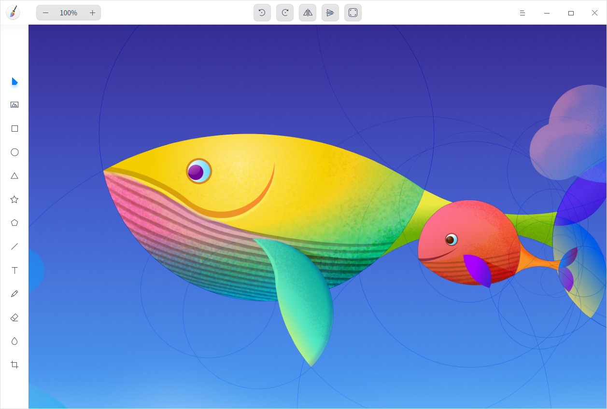
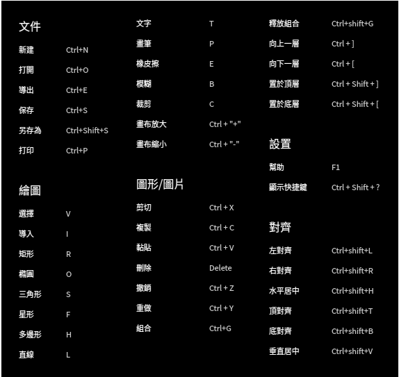
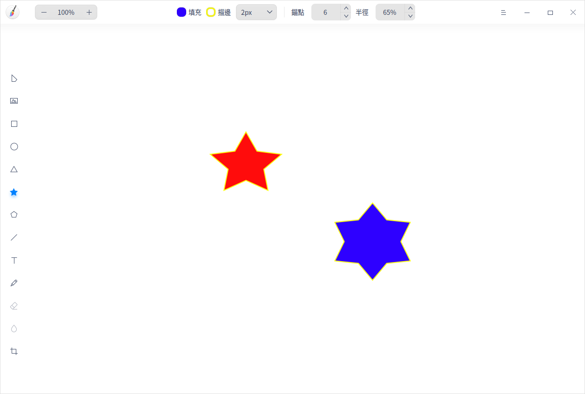
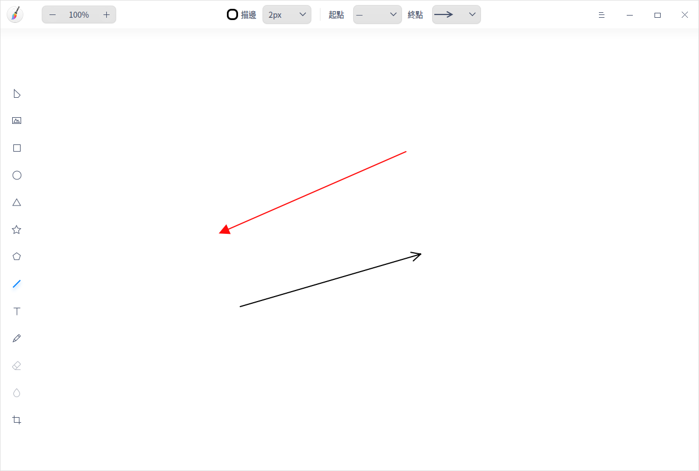
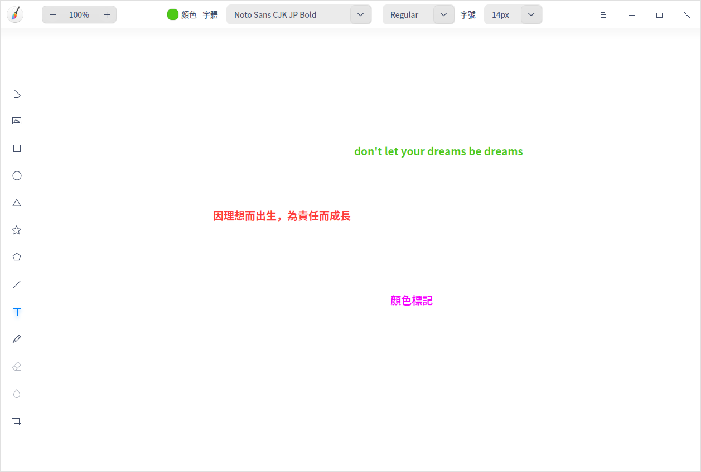
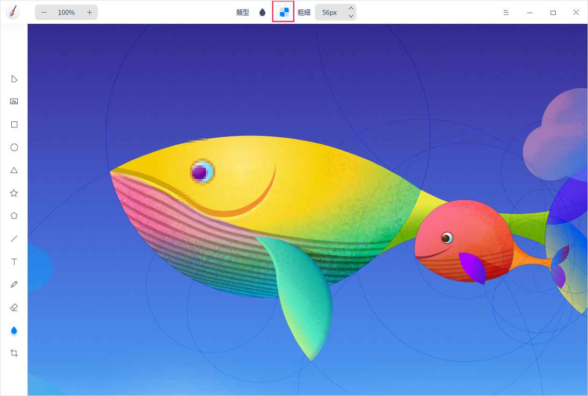
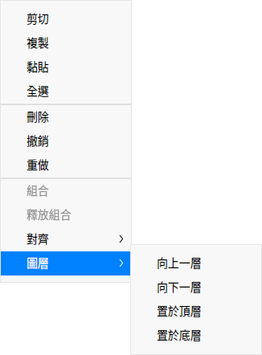
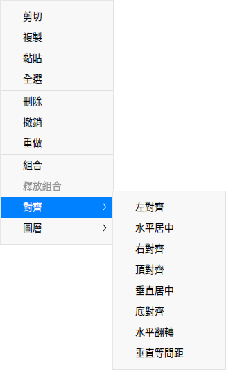
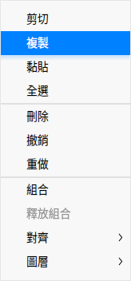
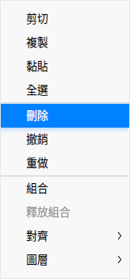

# 畫板|deepin-draw|

## 概述

畫板是一款簡單的繪圖工具，支持旋轉、裁剪、翻轉、添加文字、繪製形狀等功能。您可以對本地圖片進行簡單編輯，也可以繪製一張簡單圖片。

## 使用入門

通過以下方式運行或關閉畫板，或者創建畫板的快捷方式。

### 運行畫板

1. 單擊任務欄上的啟動器圖標 ，進入啟動器界面。
2. 上下滾動鼠標滾輪瀏覽或通過搜索，找到畫板圖標 ，單擊運行。
3. 右鍵單擊 ，您可以：
   - 單擊 **傳送到桌面**，在桌面創建快捷方式。
   - 單擊 **傳送到任務欄**，將應用程序固定到任務欄。
   - 單擊 **加至開機啟動**，將應用程序添加到開機啟動項，在電腦開機時自動運行該應用。

竅門：您可以在控制中心中將畫板設置為默認的圖片查看程序，具體操作請參考 [默認程序設置](dman:///dde#默認程序設置)。

### 關閉畫板

- 在畫板界面單擊 ，關閉畫板。
- 在任務欄右鍵單擊 ，選擇 **關閉所有**，關閉畫板。
- 在畫板界面單擊 ，選擇 **退出**，關閉畫板。

### 查看快捷鍵

在畫板界面，使用快捷鍵 **Ctrl + Shift + ?** 打開快捷鍵預覽界面。熟練地使用快捷鍵，將大大提升您的操作效率。

## 常用功能

使用畫板可以處理圖片，自由繪製圖形，並可以導出多種圖片格式。

### 新建標籤頁

- 在畫板界面，單擊  > **新建**，新建標籤頁。
- 當窗口有兩個或兩個以上標籤頁時，也可以單擊按鈕 ， 新建標籤頁。

### 關閉標籤頁

- 鼠標左鍵單擊標籤頁，單擊按鈕  關閉當前標籤頁。
- 鼠標右鍵單擊標籤頁，選擇 **關閉標籤頁** 或 **關閉其他標籤頁**。

### 打開圖片

1. 在畫板界面，單擊  或  > **打開** 。
2. 選擇想要打開的圖片，單擊 **打開** 導入圖片。

   目前僅支持導入30張圖片，且支持的圖片格式為JPG、PNG、TIF、BMP和DDF。

### 導出圖片

1. 在畫板界面，單擊  > **導出**。
2. 設置保存文件名、路徑、文件格式、圖片質量等參數。
3. 單擊 **保存**。

   

### 保存圖片

1. 在畫板界面，單擊  > **保存** 或 > **另存為**。
2. 設置保存的文件名、格式。
3. 單擊 **保存**。

> 說明：填寫保存文件名時可以省略後綴名，會自動保存為文件格式欄選擇的格式。

### 打印圖片

1. 在畫板界面，單擊  > **打印**。
2. 選擇打印機，設置打印參數。
3. 單擊 **打印**。

## 繪畫工具

使用畫板的繪畫工具，可以充分發揮您的想像力和創造力，自由繪製各種圖形。

### 形狀工具

1. 在畫板界面，單擊  或  或  或  或 。
2. 設置圖形的參數：
   - 單擊 **填充** 設置圖形的填充顏色和透明度。
   - 單擊 **描邊** 設置圖形的描邊顏色和透明度。
   - 在粗細值下拉框中設置圖形的粗細值。
   - 設置錨點數（取值範圍為3_50個）和半徑值（取值範圍為0%_100%），僅適用於星型。
   - 設置側邊數（取值範圍為4_10條），僅適用於多邊形。
   
   > 說明：錨點數、半徑值和側邊數既可以通過單擊按鈕  或  來調節，也可以選中數值後使用鍵盤  或  鍵或滾動鼠標來調節。

3. 在畫布區域拖動鼠標來繪製形狀。

> 竅門：在使用  或  或  或  或  繪製圖形時，配合鍵盤上的 **Shift** 或 **Shift + Alt** 鍵可以畫出正方形、正圓、正三角、正五角星、正多邊形。

### 直線/畫筆工具

1. 在畫板界面，單擊  或 。
2. 設置畫筆參數：
   - 單擊 **顏色** 設置畫筆的顏色和透明度。
   - 在粗細值下拉框中選擇畫筆的粗細值。
   - 設置線條的起點和終點樣式。
3. 在畫布區域拖動鼠標來繪製線條。

### 文本工具

1. 在畫板界面，單擊 。
2. 設置文本樣式：
   - 單擊 **顏色** 設置文本的填充顏色和透明度。
   - 在 **字體** 下拉框中選擇字體樣式。
   - 設置常規字體或加粗字體。
   - 在 **字號**下拉框中選擇字號大小。
3. 在畫布區域單擊鼠標後在文本框中輸入文字。

>竅門：您也可以使用快捷鍵調節字號大小：當字體處於編輯狀態時，單擊屬性欄上的字號大小，按下鍵盤上的  鍵或  鍵調節大小。

### 模糊工具

1. 在畫板界面，單擊 。
2. 選擇模糊類型。
3. 選擇塗抹區域的粗細值。
4. 在畫布區域拖動鼠標來塗抹需要模糊的區域。
> 說明：模糊工具僅對圖片操作有效，對圖形操作無效。

## 編輯功能
使用畫板的編輯功能可對圖形進行組合、裁剪、旋轉等操作；也可對圖層和文字進行調整。

### 選擇

繪製圖形後，可以進行以下操作：

- 對已繪製的圖形、文字進行選擇。
- 支持拖動鼠標框選圖形，框選中的圖形變為選擇狀態。
- 處於選擇狀態中的圖形，可拖拽邊緣調整其大小。
- 支持按住 **Shift** 鍵，選擇多個圖形。

> 說明：單擊畫板空白區域，取消當前已選圖形。

### 裁剪

1. 在畫板界面，單擊 。
2. 在屬性欄中選擇裁剪模式。
  - 自由：手動輸入尺寸或拖動裁剪邊框來調整區域，自定義裁剪畫布。
  - 原始：按照比例裁剪，如1:1、2:3、8:5、 16:9。

3. 按 **Enter** 鍵或單擊屬性欄上的圖標 ，裁剪畫布。

### 翻轉

1. 在畫板界面，選中圖片。
2. 單擊  或  將圖片垂直翻轉或水平翻轉。

### 旋轉

1. 在畫板界面，選中圖層。
2. 單擊  或  將圖層順時針或逆時針旋轉90°；或鼠標左鍵按住旋轉按鈕  來旋轉圖層。

### 自適應畫布

1. 在畫板界面，選中圖片。
2. 單擊 ，根據圖片自適應畫布大小。
  - 若選擇單張圖片，根據圖片的寬高來調整畫布大小。
   - 若選擇多張圖片，根據最大邊界範圍調整畫布大小。

### 組合/釋放組合

1. 在畫板界面，選中多個圖層。
2. 單擊鼠標右鍵選擇 **組合** 或單擊屬性欄上的圖標將圖層組合。
3. 右鍵單擊已組合的圖層，選擇 **釋放組合** 或單擊屬性欄上的圖標將已組合的圖層釋放。

> 竅門：您也可以使用快捷鍵 **Ctrl+G** 來組合圖層和 **Ctrl+Shift+G** 來釋放組合。

### 調整圖層

1. 在畫板界面，選中圖層。
2. 單擊鼠標右鍵選擇 **圖層**，在其下拉列表選擇 **向上一層**、**向下一層**、**置於頂層** 或 **置於底層** 來調整圖層順序。

### 對齊圖層

1. 在畫板界面，選中一個或多個圖層。
2. 單擊鼠標右鍵選擇 **對齊**，在其下拉列表選擇 **左對齊**、**水平居中**、**右對齊**、**頂對齊**、**垂直居中**、**底對齊**、**水平等間矩** 或 **垂直等間矩** 來調整圖層對齊方式。

>說明：
>- 僅選中一個圖層進行操作時，圖層則與畫布對齊。
>- 選中三個或三個以上的圖層時，才能進行「水平等間矩」和「垂直等間矩」的操作。

### 對齊文本

1. 在畫板界面上，單擊 ，調整文本框大小。
2. 選中文本內容後單擊鼠標右鍵選擇 **左對齊**、**右對齊**、**居中對齊** 來對齊文本。

### 複製和黏貼

1. 在畫板界面，選中需要複製的圖層。
2. 單擊鼠標右鍵選擇 **複製** 或使用快捷鍵 **Ctrl + C** 將圖層複製到剪貼板。
3. 單擊鼠標右鍵選擇 **黏貼** 或使用快捷鍵 **Ctrl + V** 將圖層黏貼到畫板上。

### 刪除

1. 在畫板界面，選中圖層。
2. 單擊右鍵選擇 **刪除** 或按下鍵盤上的 **Delete** 鍵將選中的圖層刪除。

## 主菜單

在主菜單中，您可以新建標籤頁、[打開圖片](#打開圖片)、[導出圖片](#導出圖片)、[保存圖片](#保存圖片)、切換窗口主題、查看幫助手冊，了解畫板的更多訊息。

### 新建

1. 在畫板界面，單擊 。
2. 選擇 **新建**，添加一個新的標籤頁。

### 主題

窗口主題包含淺色主題、深色主題和系統主題。

1. 在畫板界面，單擊 。
2. 選擇 **主題**，選擇一個主題顏色。

### 幫助

查看幫助手冊，進一步了解和使用畫板。

1. 在畫板界面，單擊 。
2. 選擇 **幫助**。
3. 查看畫板的幫助手冊。

### 關於

1. 在畫板界面，單擊 。
2. 選擇 **關於**。
3. 查看畫板的版本和介紹。

### 退出

1. 在畫板界面，單擊 。
2. 選擇 **退出**。
